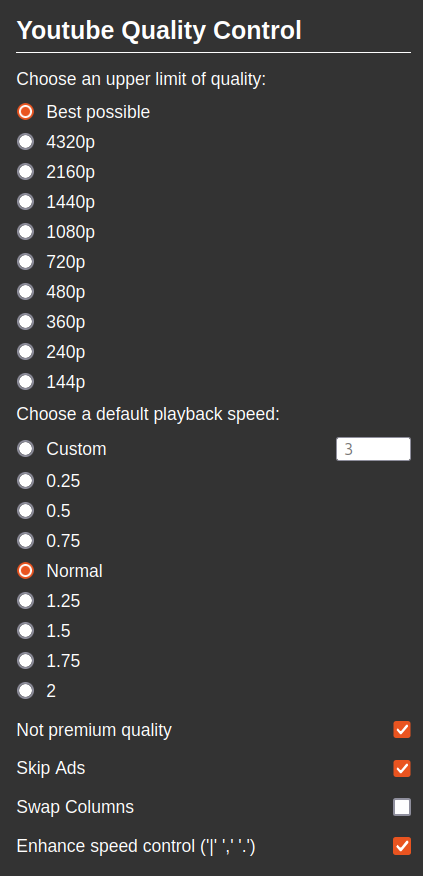

# Youtube Quality Control

Youtube Quality control is an add-on for Chrome that switches the video quality of Youtube to the one you specified automatically.

This add-on also provides Ads skipping & muting.

The "Swap Columns" option let you swap the player and comments column and the recommondation and chat column, i.e. the recommondation and chat column will be at the left and vice versa, if you perfer it to be shown in this way like me.

# About languages

The label of the setting menu item is used to identify the quality control menu. Currently only the following languages are added.

|Language|Label name|
|:--|:--|
|English|Quality|
|Japanese|画質|
|Chinese|画质|

You can add new languages labels to the `QUALITYCTRL_LABELS` array easily.

If you are interested in adding more languages to this plugin, please send me a PR.

# Notice

1. This add-on is basically a clicking simulator.
2. This add-on will also work on Firefox with a little tune in the mainfest.

# Author

[Donny](https://github.com/Donny-Hikari)
